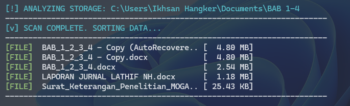

# 📂 Windows Storage Analyzer (`ls.bat`)

An interactive batch script wrapper that enhances the standard Windows Command Prompt (CMD) experience. By leveraging PowerShell under the hood, this script scans the current directory, recursively calculates folder sizes (a feature natively missing from CMD's `dir`), and displays the results sorted from largest to smallest with intuitive color-coding.

---

## ✨ Features

* **Real-Time Scan Progress:** Displays a live percentage counter and the currently scanned item while processing files and folders.
* **Recursive Folder Sizing:** Calculates the actual total size of directories (`[DIR]`), including all sub-folders and nested files.
* **Automatic Sorting:** Automatically sorts the final output by size in descending order (largest items first).
* **Human-Readable Formats:** Automatically converts byte sizes into cleanly formatted **KB**, **MB**, or **GB**.
* **Color-Coded Console Output:** * `[DIR]` is highlighted in **Yellow** 🟨
  * `[FILE]` is highlighted in **Green** 🟩
* **Smart Truncation:** Automatically truncates long file or folder names (>35 characters) with `..` to preserve a clean and aligned table layout.

---

## 📸 Preview



---

## 🚀 Installation & Setup

To make this script accessible from any directory in your Command Prompt (just like the native `ls` command in Linux), follow these steps to register your existing `ls.bat` file to your system Environment Variables:

### Step 1: Prepare Your Folder
1. Make sure your `ls.bat` file is placed inside a dedicated folder anywhere on your **C:** drive (for example: `C:\MyScripts` or `C:\bin`).

### Step 2: Add the Folder to Environment Variables (PATH)
1. Open the Windows Start Menu, type **`env`**, and select **Edit the system environment variables**.
2. Click on the **Environment Variables...** button at the bottom right of the window.
3. In the **User variables** section (top half) or **System variables** section (bottom half), look for the variable named **`Path`** (or `PATH`), select it, and click **Edit...**.
4. Click the **New** button on the right side.
5. Type or paste the full path of the folder where your script is stored (e.g., `C:\MyScripts` or `C:\bin`).
6. Click **OK** on all open windows to apply and save the changes.

---

## 💻 Usage

Open a brand new **Command Prompt (CMD)** window (do not use an already open one, as it needs to load the new environment variables), navigate to any directory you want to inspect, and simply type:

```cmd
ls
